# Mermaid 可视化增强指南

## 📖 简介

本指南介绍如何使用 Mermaid 图表增强源码文档的可视化效果，替代传统的 ASCII 艺术图。

**优势**：
- ✅ 更清晰的视觉效果
- ✅ 更强的表达能力
- ✅ 更易于维护
- ✅ 支持多种图表类型
- ✅ 可导出为高质量图片

---

## 🎯 适用场景

### 何时使用 Mermaid

| 场景 | ASCII 图 | Mermaid 图 | 推荐 |
|-----|---------|-----------|-----|
| 简单流程（<5步） | ✅ | ✅ | ASCII（更快） |
| 复杂流程（>5步） | ⚠️ | ✅ | **Mermaid** |
| 状态机 | ⚠️ | ✅ | **Mermaid** |
| 时序图 | ❌ | ✅ | **Mermaid** |
| 类图/架构图 | ⚠️ | ✅ | **Mermaid** |
| 甘特图 | ❌ | ✅ | **Mermaid** |

### 对比示例

#### ASCII 版本（简单但受限）

```
流程：
┌──────┐
│ 开始 │
└───┬──┘
    ↓
┌───────┐
│ 处理  │
└───┬───┘
    ↓
┌──────┐
│ 结束 │
└──────┘
```

#### Mermaid 版本（强大且美观）

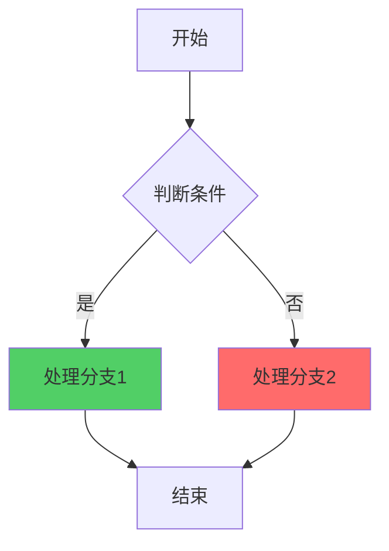

---

## 🚀 快速开始

### 步骤 1：在 Markdown 中编写 Mermaid

直接在文档中使用 ` ```mermaid ` 代码块：

````markdown
### 示例：DDP 通信流程

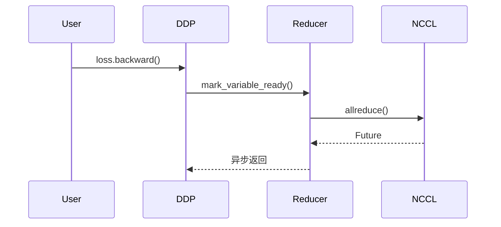
````

### 步骤 2：生成 HTML（用于预览或截图）

```bash
# 从 Markdown 提取 Mermaid 并生成 HTML
python scripts/mermaid_to_html.py your_document.md -o output_html/

# 生成的 HTML 可以在浏览器中直接打开预览
```

### 步骤 3：转换为图片（可选）

#### 方案 A：自动截图（需要 Playwright）

```bash
# 安装 Playwright
pip install playwright
playwright install chromium

# 批量转换 HTML 为图片
python scripts/mermaid_to_image.py output_html/ -o images/
```

#### 方案 B：手动截图

```bash
# 生成手动截图指南
python scripts/mermaid_to_image.py output_html/ --manual

# 然后按照生成的指南手动截图
```

#### 方案 C：使用在线工具

1. 访问 https://mermaid.live/
2. 粘贴 Mermaid 代码
3. 导出 PNG/SVG

### 步骤 4：替换 Markdown 中的代码（可选）

```bash
# 将 Mermaid 代码块替换为图片引用
python scripts/replace_mermaid_with_images.py your_document.md -i images/

# 预览模式（不实际修改）
python scripts/replace_mermaid_with_images.py your_document.md -i images/ --dry-run

# 不保留原始代码
python scripts/replace_mermaid_with_images.py your_document.md -i images/ --no-keep-code
```

---

## 📊 Mermaid 图表类型

### 1. 流程图（Flowchart）

**用途**：展示算法逻辑、执行流程

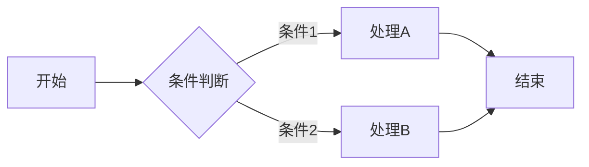

**代码**：
````markdown

````

### 2. 时序图（Sequence Diagram）

**用途**：展示时间维度的交互、函数调用链

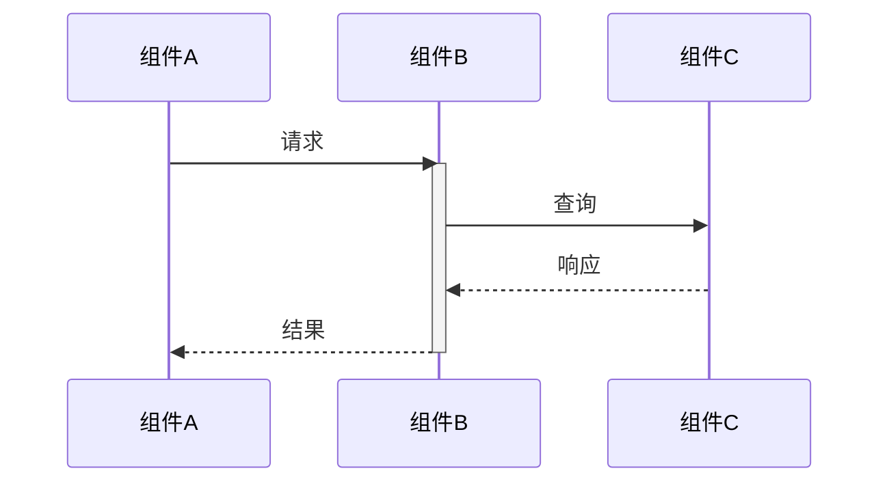

**代码**：
````markdown

````

### 3. 状态图（State Diagram）

**用途**：展示状态转换、生命周期

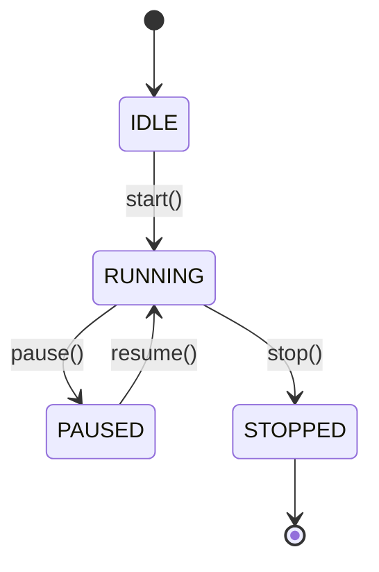

**代码**：
````markdown

````

### 4. 类图（Class Diagram）

**用途**：展示类关系、继承结构

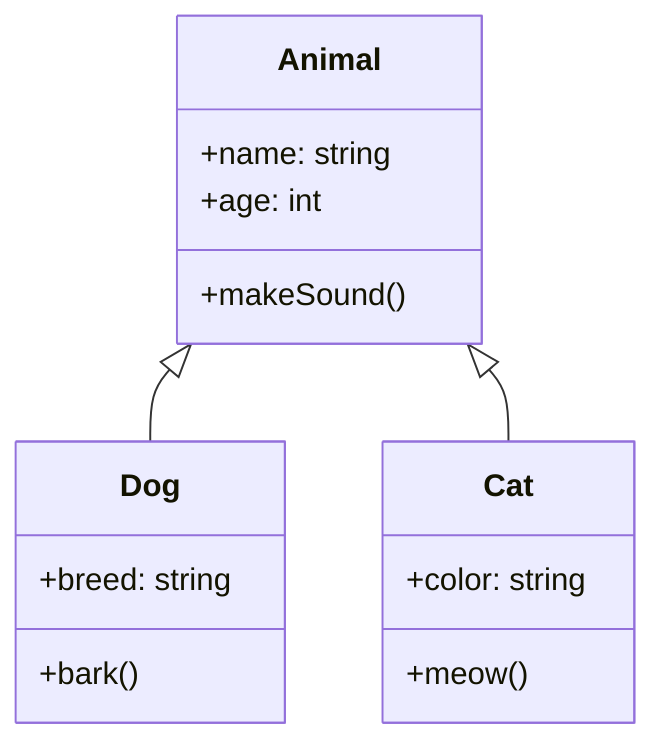

**代码**：
````markdown
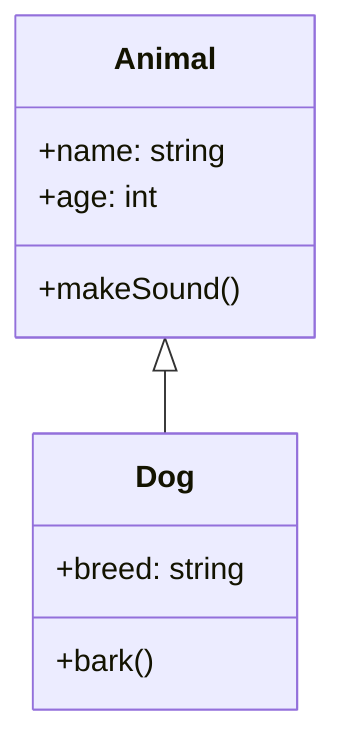
````

### 5. 甘特图（Gantt Chart）

**用途**：展示时间线、任务调度、性能对比

```mermaid
gantt
    title 训练流程时间线
    dateFormat X
    axisFormat %L

    section Forward
    Layer1 计算    :a1, 0, 10
    Layer2 计算    :a2, 10, 20
    Layer3 计算    :a3, 20, 30

    section Backward
    Layer3 梯度    :b1, 30, 40
    Layer2 梯度    :b2, 40, 50
    Layer1 梯度    :b3, 50, 60

    section Communication
    AllReduce      :crit, c1, 45, 70
```

### 6. Git 图（Git Graph）

**用途**：展示版本分支、数据流

```mermaid
gitgraph
    commit id: "初始化"
    branch develop
    commit id: "添加功能A"
    commit id: "添加功能B"
    checkout main
    merge develop
    commit id: "发布 v1.0"
```

---

## 🎨 样式定制

### 节点样式

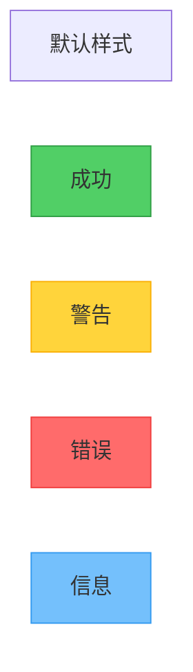

**代码**：
````markdown
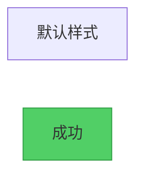
````

### 主题配置

在 HTML 模板中配置主题：

```javascript
mermaid.initialize({
    theme: 'default',  // 或 'dark', 'forest', 'neutral'
    themeVariables: {
        primaryColor: '#74c0fc',
        primaryTextColor: '#000',
        primaryBorderColor: '#339af0'
    }
});
```

---

## 💡 最佳实践

### 1. 选择合适的图表类型

| 要展示的内容 | 推荐图表 |
|------------|---------|
| 执行流程、算法逻辑 | Flowchart |
| 时间维度交互、函数调用 | Sequence Diagram |
| 状态转换、生命周期 | State Diagram |
| 类关系、继承结构 | Class Diagram |
| 任务调度、性能对比 | Gantt Chart |
| 模块关系、架构 | Flowchart (TB/LR) |

### 2. 保持简洁

- ✅ 每个图表聚焦一个主题
- ✅ 节点数量控制在 10-15 个以内
- ✅ 使用子图（subgraph）组织复杂内容
- ❌ 避免过于复杂的图表

### 3. 使用有意义的标签

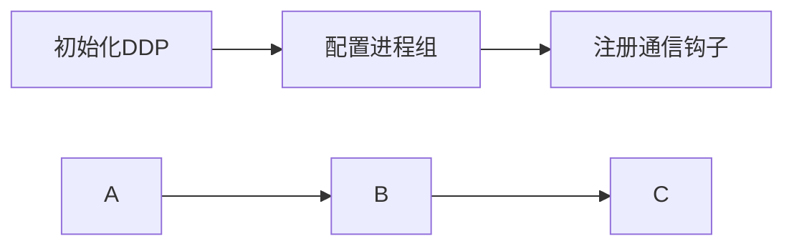

### 4. 添加注释和说明

```mermaid
flowchart TD
    A[开始] --> B[处理]
    B --> C[结束]

    note right of B: 这里进行<br/>复杂的计算
```

### 5. 使用颜色突出重点


---

## 🛠️ 工具链使用

### 完整工作流

```bash
# 1. 在 Markdown 中编写 Mermaid 代码
vim your_document.md

# 2. 提取并生成 HTML
python scripts/mermaid_to_html.py your_document.md -o html_output/

# 3. 在浏览器中预览（可选）
open html_output/your_document-mermaid-01-*.html

# 4. 转换为图片（自动）
python scripts/mermaid_to_image.py html_output/ -o images/

# 5. 替换 Markdown（可选）
python scripts/replace_mermaid_with_images.py your_document.md -i images/

# 6. 验证结果
cat your_document.md
```

### 批量处理

```bash
# 处理整个目录的文档
python scripts/mermaid_to_html.py docs/ -d -o html_output/
python scripts/mermaid_to_image.py html_output/ -o images/

# 批量替换所有文档
for file in docs/*.md; do
    python scripts/replace_mermaid_with_images.py "$file" -i images/
done
```

---

## 📚 实战示例

### 示例 1：DDP Static Graph 优化

参见 [DDP原理与源码解读-第6章-通信钩子和优化机制-可视化增强版.md](../torch/pytorch/DDP原理与源码解读-第6章-通信钩子和优化机制-可视化增强版.md)

### 示例 2：梯度同步流程

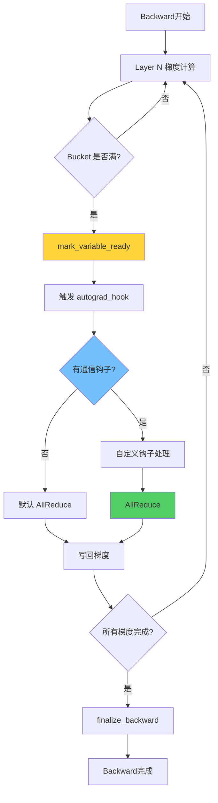

---

## 🔧 故障排除

### 问题 1：Mermaid 代码不渲染

**原因**：语法错误或不支持的特性

**解决**：
1. 在 https://mermaid.live/ 中验证语法
2. 查看浏览器控制台错误
3. 参考 [Mermaid 文档](https://mermaid.js.org/)

### 问题 2：生成的图片质量差

**解决**：
1. 调整 Playwright 的 viewport 大小
2. 使用 SVG 格式而不是 PNG
3. 增加等待时间让动画完成

### 问题 3：中文显示乱码

**解决**：
1. 确保 HTML 文件使用 UTF-8 编码
2. 在 HTML 模板中添加字体配置

```css
body {
    font-family: 'PingFang SC', 'Hiragino Sans GB', sans-serif;
}
```

---

## 📖 参考资源

- [Mermaid 官方文档](https://mermaid.js.org/)
- [Mermaid Live Editor](https://mermaid.live/)
- [Mermaid CLI](https://github.com/mermaid-js/mermaid-cli)
- [Playwright 文档](https://playwright.dev/)

---

## 🚀 全自动流水线（推荐方案）

### 方案 4：一键完成所有步骤

**工具**：`mermaid_full_pipeline.py`

**特点**：
- ✅ **全自动**：一个命令完成所有步骤
- ✅ **无需浏览器**：使用 wkhtmltoimage（本地渲染）
- ✅ **无需网络**：完全离线执行
- ✅ **支持 PDF 导出**：自动生成 PDF 文档

### 使用方法

```bash
# 完整流水线（推荐）
python scripts/mermaid_full_pipeline.py your_document.md -o output/

# 只生成 PDF（不处理 Mermaid）
python scripts/mermaid_full_pipeline.py your_document.md --pdf-only

# 详细输出
python scripts/mermaid_full_pipeline.py your_document.md -o output/ -v
```

### 执行流程

```
输入 Markdown
    ↓
[1/5] 提取 Mermaid 代码块
    ↓
[2/5] 生成 HTML 文件
    ↓
[3/5] 生成图片（wkhtmltoimage）
    ↓
[4/5] 更新 Markdown（替换 Mermaid 为图片引用）
    ↓
[5/5] 导出 PDF（pandoc/wkhtmltopdf）
    ↓
输出目录
├── html/          # HTML 中间文件
├── images/        # PNG 图片文件
├── document.md    # 更新后的 Markdown
└── document.pdf   # 最终 PDF 文档
```

### 输出示例

```bash
$ python scripts/mermaid_full_pipeline.py document.md -o output/ -v

============================================================
  Mermaid 全自动处理流水线
============================================================

[1/5] 提取 Mermaid 代码块...
  ✓ 找到 8 个 Mermaid 代码块

[2/5] 生成 HTML 文件...
  ✓ [1/8] mermaid-01-时序对比图.html
  ✓ [2/8] mermaid-02-架构对比图.html
  ...

[3/5] 生成图片...
  ✓ 生成: mermaid-01-时序对比图.png
  ✓ 生成: mermaid-02-架构对比图.png
  ...
  ✓ 成功生成 8/8 个图片

[4/5] 更新 Markdown（替换 Mermaid 为图片引用）...
  ✓ 已保存: output/document.md

[5/5] 导出 PDF...
  ✓ PDF 已生成: output/document.pdf (680 KB)

============================================================
  完成！
============================================================
```

### 优势对比

| 方案 | 自动化 | 网络需求 | 浏览器需求 | PDF 支持 | 推荐度 |
|-----|-------|---------|-----------|---------|--------|
| **全自动流水线** | ✅ 完全自动 | ❌ 无需 | ❌ 无需 | ✅ 支持 | ⭐⭐⭐⭐⭐ |
| 方案 1（Playwright） | ✅ 自动 | ❌ 无需 | ✅ 需要 | ⚠️ 需额外步骤 | ⭐⭐⭐⭐ |
| 方案 2（在线 API） | ✅ 自动 | ✅ 需要 | ❌ 无需 | ⚠️ 需额外步骤 | ⭐⭐⭐ |
| 方案 3（手动） | ❌ 手动 | ❌ 无需 | ✅ 需要 | ⚠️ 需额外步骤 | ⭐⭐ |

### 依赖安装

```bash
# Ubuntu/Debian
sudo apt-get install -y wkhtmltopdf pandoc

# 验证安装
which wkhtmltoimage wkhtmltopdf pandoc
```

### 注意事项

1. **图片路径**：生成的 Markdown 中图片路径为 `images/`，如需使用 `mermaid_images/`，可手动替换或修改脚本
2. **PDF 质量**：使用 `wkhtmltopdf` 生成，质量较高，支持中文
3. **保留源码**：Mermaid 源码保留在 `<details>` 折叠区域，便于维护

---

## ✨ 总结

**何时使用 Mermaid**：
- ✅ 复杂流程、状态机、时序图
- ✅ 需要高质量可视化
- ✅ 文档需要导出为 PDF/图片

**何时使用 ASCII**：
- ✅ 简单流程（<5步）
- ✅ 快速草图
- ✅ 纯文本环境

**推荐工作流**：
1. 初稿使用 ASCII（快速）
2. 重要章节使用 Mermaid（高质量）
3. 发布前转换为图片（兼容性）

---

**Happy Visualizing! 🎨**
