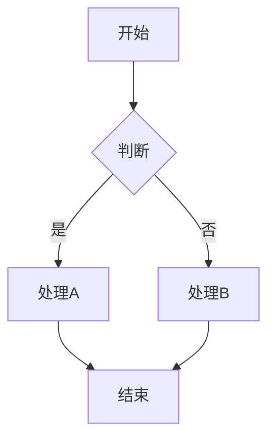

# Mermaid 可视化 + MCP 截图 - 完整方案

## 🎯 核心流程

```
Markdown (Mermaid 代码)
    ↓
mermaid_to_html.py → HTML 文件
    ↓
Cursor MCP 浏览器 → PNG 图片
    ↓
replace_mermaid_with_images.py → Markdown (图片引用)
```

---

## 📋 完整步骤

### 步骤 1：编写 Mermaid 代码

在 Markdown 中直接编写 Mermaid 图表：

````markdown
### 示例：流程图


````

### 步骤 2：生成 HTML 文件

```bash
python scripts/mermaid_to_html.py your_doc.md -o html_output/ -v
```

**输出**：
- 每个 Mermaid 代码块生成一个独立 HTML 文件
- HTML 包含完整的样式和 Mermaid 渲染器
- 可直接在浏览器中打开查看

### 步骤 3：使用 Cursor MCP 截图

**在 Cursor 中新建对话，发送请求**：

```
请使用浏览器 MCP 工具截图 Mermaid 图表。

源目录：html_output/
输出目录：images/

操作要求（每个 HTML）：
1. 打开文件（file:// 协议）
2. 等待 .mermaid svg 元素出现
3. 等待 1-2 秒确保渲染
4. 使用开发者工具：F12 → Ctrl+Shift+P → "Capture node screenshot"
5. 点击 .container 元素
6. 保存为 PNG

请处理目录中的所有 HTML 文件。
```

### 步骤 4：替换 Markdown（可选）

```bash
# 预览替换
python scripts/replace_mermaid_with_images.py \
    your_doc.md -i images/ --dry-run

# 执行替换
python scripts/replace_mermaid_with_images.py \
    your_doc.md -i images/
```

---

## 🛠️ 实战案例：DDP 第6章

### 执行记录

```bash
# 已完成的步骤
cd /home/aibert.liu/libra/code/ai_infra/torch/pytorch

# [✅] 步骤 1: 编写 Mermaid
# 文件：DDP原理与源码解读-第6章-通信钩子和优化机制-最终版.md
# 内容：8 个 Mermaid 图表

# [✅] 步骤 2: 生成 HTML
python /home/aibert.liu/libra/code/ai_infra/skills/source_code_learn_skill/scripts/mermaid_to_html.py \
    "DDP原理与源码解读-第6章-通信钩子和优化机制-可视化增强版.md" \
    -o mermaid_html_test/ -v
# 输出：8 个 HTML 文件 ✅

# [⏳] 步骤 3: MCP 截图
# 操作：在 Cursor 中新建对话
# 请求：见下方模板

# [⏳] 步骤 4: 替换 Markdown
# 脚本已就绪，等待截图完成后执行
```

### MCP 截图请求模板

```markdown
请使用浏览器 MCP 工具批量截图。

源目录：/home/aibert.liu/libra/code/ai_infra/torch/pytorch/mermaid_html_test/
输出目录：/home/aibert.liu/libra/code/ai_infra/torch/pytorch/mermaid_images/

需要截图 8 个 HTML 文件，每个文件：
1. 在浏览器中打开
2. 等待 .mermaid svg 元素
3. F12 → Ctrl+Shift+P → "Capture node screenshot"
4. 点击 .container 元素
5. 保存为 PNG

文件清单（请逐个处理）：
[1/8] DDP原理与源码解读-第6章-...-mermaid-01-时序对比图.html
[2/8] DDP原理与源码解读-第6章-...-mermaid-02-架构对比图.html
[3/8] DDP原理与源码解读-第6章-...-mermaid-03-性能提升对比.html
[4/8] DDP原理与源码解读-第6章-...-mermaid-04-Mermaid-流程图.html
[5/8] DDP原理与源码解读-第6章-...-mermaid-05-Mermaid-序列图.html
[6/8] DDP原理与源码解读-第6章-...-mermaid-06-Mermaid-状态图.html
[7/8] DDP原理与源码解读-第6章-...-mermaid-07-Mermaid-流程图.html
[8/8] DDP原理与源码解读-第6章-...-mermaid-08-Mermaid-类图用于对比.html
```

---

## ✅ 验证与替换

### 验证脚本

```bash
bash /home/aibert.liu/libra/code/ai_infra/torch/pytorch/验证并替换.sh
```

### 手动验证

```bash
cd /home/aibert.liu/libra/code/ai_infra/torch/pytorch/mermaid_images
ls -lh *.png | wc -l  # 应该是 8
```

### 替换 Markdown

```bash
cd /home/aibert.liu/libra/code/ai_infra/torch/pytorch

# 预览
python /home/aibert.liu/libra/code/ai_infra/skills/source_code_learn_skill/scripts/replace_mermaid_with_images.py \
    "DDP原理与源码解读-第6章-通信钩子和优化机制-最终版.md" \
    -i mermaid_images/ --dry-run

# 执行（会自动备份原文件）
python /home/aibert.liu/libra/code/ai_infra/skills/source_code_learn_skill/scripts/replace_mermaid_with_images.py \
    "DDP原理与源码解读-第6章-通信钩子和优化机制-最终版.md" \
    -i mermaid_images/
```

---

## 🎨 预期效果

### 替换前（Mermaid 代码）

````markdown
```mermaid
gantt
    title 性能对比
    ...
```
````

### 替换后（图片引用）

```markdown


<details>
<summary>查看 Mermaid 源码</summary>

```mermaid
gantt
    title 性能对比
    ...
```

</details>
```

**优势**：
- ✅ 图片可在任何平台查看（PDF、Word 等）
- ✅ 保留原始 Mermaid 代码（折叠区域）
- ✅ 兼容性最佳

---

## 📚 相关文档

- [MERMAID_VISUALIZATION_GUIDE.md](MERMAID_VISUALIZATION_GUIDE.md) - 完整使用指南
- [MCP浏览器截图完整指南.md](MCP浏览器截图完整指南.md) - MCP 详细说明
- [README.md](README.md) - 主文档（第 6 节）

---

## 💡 最佳实践

### 何时使用 Mermaid + MCP 截图

✅ **推荐使用**：
- 需要导出 PDF 的文档
- 发布到不支持 Mermaid 的平台
- 需要固定样式的文档
- 复杂图表需要高质量渲染

✅ **直接使用 Mermaid（更简单）**：
- GitHub/GitLab 发布
- 团队内部文档（Cursor/VS Code）
- 在线文档（支持 Mermaid 渲染）

### 工作流建议

1. **初稿**：直接使用 Mermaid 代码（快速迭代）
2. **审阅**：在 Cursor/GitHub 中预览
3. **发布**：根据目标平台决定是否转换为图片
   - GitHub/GitLab → 保留 Mermaid
   - PDF/Word → 转换为图片

---

**Happy Visualizing with MCP! 🎨**
